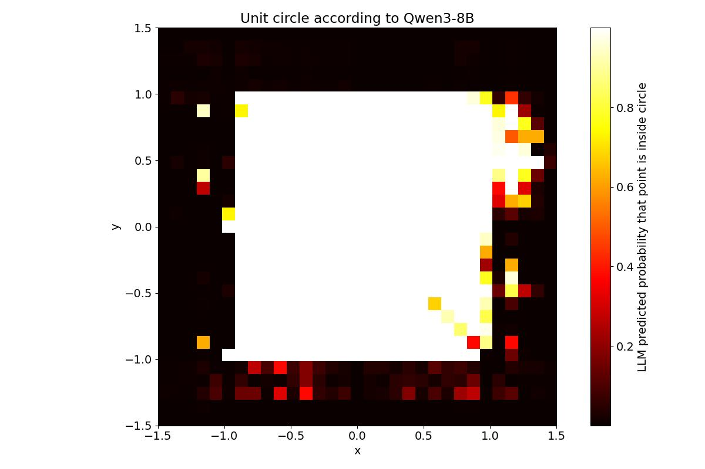
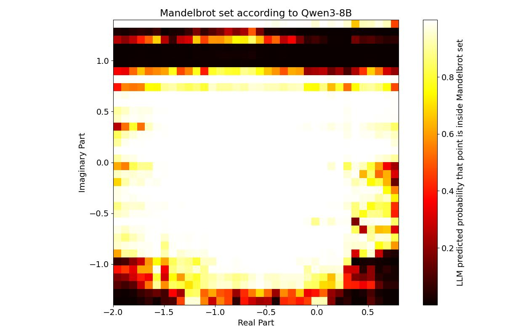

# LLM Coordinate Images

Inspired by https://outsidetext.substack.com/p/how-does-a-blind-model-see-the-earth, exploring creating images by probing output probabilities of an LLM, asking a question about one coordinate at a time.

Currently getting resulting probabilities at a rate of about 15 points per second using Qwen3-8B and one Nvidia RTX 3090 and vLLM (chosen to hopefully maximally utilize the possible caching when using many very similar prompts in a row).

Tried testing this by generating a circle and a Mandelbrot set, but neither look very impressive with Qwen3-8b:






```
uv venv
source .venv/bin/activate
uv pip install torch torchvision --index-url https://download.pytorch.org/whl/cu126
uv pip install transformers
uv pip install accelerate
uv pip install vllm --torch-backend=auto
uv pip install ipykernel matplotlib
```
